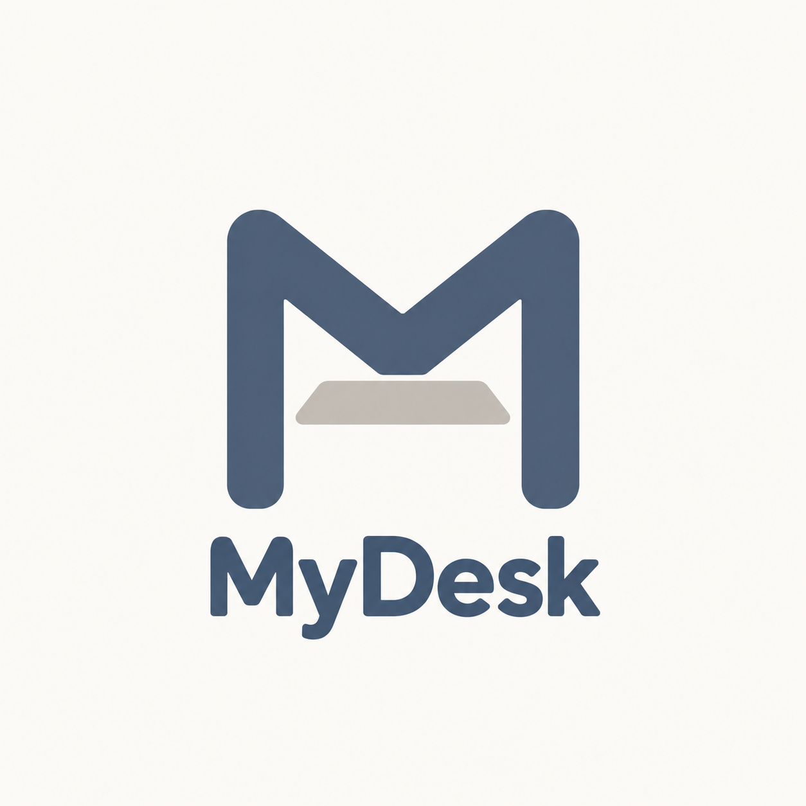
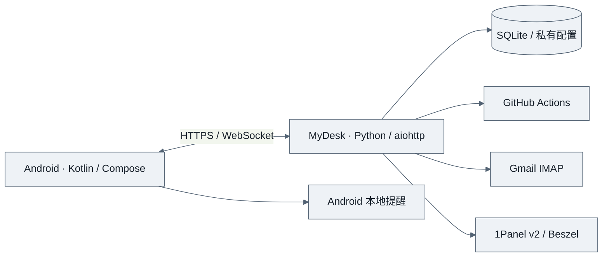

<p align="center">
  
</p>

<h1 align="center">MyDesk</h1>

<p align="center">把提醒、邮件和任务状态，放进一个属于自己的工作台。</p>

<p align="center">
  <a href="https://github.com/xiaoxiaoxiaoHuanGe/MyDesk/releases/latest"></a>
  <a href="https://github.com/xiaoxiaoxiaoHuanGe/MyDesk/actions/workflows/ci.yml"></a>
  
  <a href="LICENSE"></a>
</p>

<p align="center">
  <a href="https://github.com/xiaoxiaoxiaoHuanGe/MyDesk/releases/latest">下载 Android APP</a> ·
  <a href="#快速开始">快速开始</a> ·
  <a href="docs/DEPLOY.md">部署文档</a> ·
  <a href="https://github.com/xiaoxiaoxiaoHuanGe/MyDesk/issues">反馈问题</a>
</p>

---

MyDesk 是一个可自行部署的个人工作台，由 **原生 Android APP + Python 后端**组成。手机负责日常查看、操作和本地提醒；后端持续获取外部服务信息，让邮箱和自动任务的同步不依赖手机一直在线。

界面包含四个主要页面：**工作台、提醒、步数、设置**。需要处理的事项集中展示并可点击直接处理，正常状态保持简洁；支持浅色、深色、跟随系统，以及左右滑动切换页面。

## 可以做什么

| 功能 | 使用方式 |
| --- | --- |
| ⏰ 即时提醒 | 日期或倒计时滚轮，完成、取消、稍后提醒；同步到手机后由系统闹钟触发 |
| 🧩 自动任务 | 多个 GitHub Actions 工作流独立配置，查看运行状态、业务结果与历史，每项单独设置超期规则 |
| ✉️ 最近邮件 | 多个 Gmail 邮箱，合并显示按时间排序的最近 3 封邮件，支持按邮箱筛选 |
| 🖥️ 服务器状态 | 多台 1Panel v2 / Beszel 服务器，查看 CPU、内存、磁盘、负载等指标 |
| 🌐 网络连通性 | 管理和搜索检测节点，查看连通状态、延迟及错误原因 |
| 👟 步数 | 独立页面，手动提交、自动任务与每轮运行记录；统一保存配置，支持每日安排、异常确认与随时终止 |
| 💬 每日一言 | 后端每日获取并缓存一言，失败时保留旧内容或使用默认语句 |
| 🔐 配置备份 | 密码加密导出，导入预览，合并或替换配置，并保留恢复前配置 |

渐进步数和预设的操作说明见 [使用指南](docs/STEP_PLANS.md)。

每个 GitHub 任务、邮箱和服务器使用独立凭据。点击 **立即同步**会统一查询 GitHub、邮件、服务器和网络，不会替你执行签到或提交步数。

## 快速开始

### 1. 部署后端

Linux 服务器需要 Docker 和 Docker Compose。以下配置让 MyDesk 只监听本机 `127.0.0.1:8787`，供反向代理访问。

```sh
git clone https://github.com/xiaoxiaoxiaoHuanGe/MyDesk.git
cd MyDesk
mkdir -p data
sudo chown 10001:10001 data
sudo chmod 700 data
docker compose -f deploy/compose.server.yaml up -d --build
curl --fail http://127.0.0.1:8787/health
```

首次启动自动创建账号和随机密码，在服务器本机查看：

```sh
sudo cat data/LOCAL_ACCESS.md
```

为后端配置带可信证书的 HTTPS 域名，启用 WebSocket 转发。具体示例见 [部署文档](docs/DEPLOY.md)。

### 2. 安装 Android APP

从 [Releases](https://github.com/xiaoxiaoxiaoHuanGe/MyDesk/releases/latest) 下载 `MyDesk-1.2.1-release.apk`，安装后填写你的 **HTTPS 服务地址**，使用上一步生成的账号登录。

系统要求 **Android 8.0 或更高版本**。正式版验证系统信任的 HTTPS 证书；首次创建提醒前，按 APP 引导授予通知和准确提醒权限。

> [!NOTE]
> APP 需要连接你部署的 MyDesk 后端。仓库不提供公共服务器，也不内置任何个人服务地址或接入凭据。

### 3. 接入需要的服务

在 **设置 → 外部服务接入** 中添加：

- **GitHub 任务**：填写仓库所有者、仓库、工作流文件名、分支和该任务独立的 Token。普通状态查询使用 Actions 只读权限。
- **Gmail 邮件**：填写完整邮箱地址及该账号的应用专用密码。需要代理时，填写后端可访问的 HTTP 代理地址和端口。
- **服务器监控**：选择 1Panel v2 或 Beszel，填写地址及独立凭据；1Panel 需配置允许后端出口 IP 的白名单。

填写后保存，重新打开该项，点击“检查已保存的连接”。详细说明见 [服务接入](docs/SERVICES.md)。

## 同步与通知

| 数据 | 后台查询周期 |
| --- | --- |
| GitHub 自动任务 | 约 10 分钟 |
| Gmail 邮件 | 约 2 分钟 |
| 服务器与网络 | 约 1 分钟 |
| 每日一言 | 按工作台时区每天更新，失败后重试 |

实际时间受请求耗时和网络影响；“立即同步”可绕过定时等待。

**本地提醒与远程推送是两种机制。** 已同步到手机的提醒由 Android AlarmManager 调度，可显示通知、横幅和锁屏提醒，具体表现受系统通知渠道及设备策略影响。GitHub、邮件等结果会更新工作台；如需 APP 关闭时即时收到服务器通知，还需要自行配置 Firebase/FCM 并验证设备可用性，见 [通知说明](docs/NOTIFICATIONS.md)。公开 APK 不包含个人 Firebase 配置。

## 自己掌握数据

- 凭据和历史保存在你的后端，API 向客户端返回接入状态时隐藏服务凭据。
- 登录采用服务端会话、HttpOnly Cookie 和 CSRF 校验；Android 会话使用系统密钥库加密保存。
- Gmail 只读取标题、发件人、时间和未读状态，不读取正文或标记已读。
- 配置备份使用 AES-256-GCM 和 PBKDF2；导出的文件包含接入凭据，请保管密码与备份。
- GitHub 运行查询只读取记录；手动步数提交是独立的主动操作。
- APP 未启用 Firebase Analytics；接入第三方服务时，请同时了解相应服务的隐私政策。

## 架构与开发



后端使用 Python 3.12，Android 使用 Kotlin、Jetpack Compose、Room 和 WorkManager。提供浏览器工作台用于桌面访问；Android APP 是主要移动端。

```sh
python -m venv .venv
# Linux / macOS
. .venv/bin/activate
# Windows PowerShell 使用 .venv\Scripts\Activate.ps1
python -m pip install -r requirements-dev.txt
python -m unittest discover -s tests -v
node --test tests/frontend.test.mjs tests/standalone.test.mjs
python -m mydesk --data .local/standalone --host 127.0.0.1 --port 8787
```

Android 构建及正式签名步骤见 [Android 开发说明](android/README.md)。签名私钥、运行数据和本机配置均不纳入仓库。

## 常见问题

<details>
<summary>代理、工作流、多用户与 APK 升级</summary>

**手机需要一直开代理吗？**  
不需要。外部服务由后端查询。Gmail 可为每个邮箱设置 HTTP 代理，代理地址指后端能访问的地址。

**任意 GitHub 工作流都能接入吗？**  
可以用“自定义任务 → 工作流状态”查看执行结果。若需要积分、签到详情等业务信息，需要工作流输出受支持的标准结果。进程执行成功不一定意味着业务成功。

**支持多个用户共享吗？**  
目前面向个人使用和单账号后端，尚未提供多租户隔离。不同使用者建议独立部署。

**可以从之前的调试 APK 直接升级吗？**  
调试版和正式版签名不同，Android 无法直接覆盖安装。切换前先同步待处理操作并导出配置备份；首次安装正式版后重新登录、检查权限和提醒。后续正式版使用同一签名，可正常升级。

</details>

## 参与项目

欢迎通过 [Issues](https://github.com/xiaoxiaoxiaoHuanGe/MyDesk/issues) 反馈问题或提交 Pull Request。提交截图和日志前请隐藏账号、服务地址与凭据。开发约定见 [CONTRIBUTING.md](CONTRIBUTING.md)，安全问题请参阅 [SECURITY.md](SECURITY.md)。

MyDesk 源码采用 [MIT License](LICENSE)。第三方依赖遵循各自许可证，见 [THIRD_PARTY_NOTICES.md](THIRD_PARTY_NOTICES.md)。
